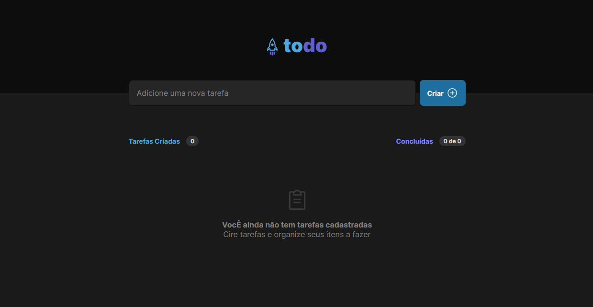

# ToDoList

Durante este desafio, utilizamos os conceitos básicos do React desenvolvendo do zero uma simples lista de tarefas com as opções de criar e apagar um item da lista.

### 🛠️ Nesse projeto foi utilizado

* Vite
* CSS Modules
* Typescript
* Local Storage